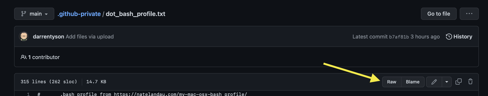

# Computational resources

### Shell
The command line environment is referred to as a "shell." You are most likely using either `bash` or `zsh` (an updated shell becoming the standard on Macs).  

* To make your shell environment a little easier to work in, I have added files that you can copy onto your own computers and rename appropriately to
`.bash_profile` or `.zshrc`. **NOTE: if you already have files with these names in your home directory (`~`), you should first save those with a new name like `mv ~/.bash_profile ~/.bash_profile_old`.** The files are avaialble within this repository as [dot_bash_profile.txt](dot_bash_profile.txt) and [dot_zshrc.txt](dot_zshrc.txt). To download these file from GitHub directly you must:  

  open the raw data 

  

  and save the source to your computer.  

### Markdown  
* [GitHub Markdown](https://docs.github.com/github/writing-on-github/getting-started-with-writing-and-formatting-on-github/basic-writing-and-formatting-syntax) is a scripting language to "mark" text files so they are automatically rendered on GitHub to be more functional as web pages.  It is what all the [README.md](README.md) files are written in. Here is more detailed information about [GitHub Markdown](https://github.github.com/gfm/).  

### Git
_Installing on macOS_  
There are several ways to install Git on a Mac. The easiest is probably to install the Xcode Command Line Tools. On Mavericks (10.9) or above you can do this simply by trying to run git from the Terminal the very first time.  

Type `git --version` in Terminal.  If you don’t have it installed already, it will prompt you to install it.  

_Installing on Windows_  
Recommended installation is from [GitForWindows at https://gitforwindows.org](https://gitforwindows.org) NOTE: This also has a built-in git GUI.  

### Connecting to GitHub using ssh keys
[help for setting up ssh keys for GitHub](https://docs.github.com/en/authentication/connecting-to-github-with-ssh). 

### Git GUI
There are many graphical user interfaces for git. My recommendation is [Atlassian's Sourcetree](https://www.sourcetreeapp.com). You will need to get a free Atlassian account.  

* [How to use the special `.gitgnore` file](https://www.atlassian.com/git/tutorials/saving-changes/gitignore). This file should be in the root directory of the git repository. (NOTE: **You can only have one file per repository!**; `.gitginore` files in other locations within a repo (e.g. inside the `users` directory are considered regular files that should be tracked and managed within the repository.)

### Miniconda  
Miniconda is lightweight, bare bones version of Anaconda that has everything you will need to get started. You can download it [here](https://docs.conda.io/en/latest/miniconda.html)  

For other computational resources, see [02 Computational tools lecture slides](https://docs.google.com/presentation/d/1upWUwub7I2V55h7Ij1tUArmpMoxmLzRc/edit?usp=sharing&ouid=115249411517790465047&rtpof=true&sd=true)  

### NetLogo  
We will be using a freely available piece of software for agent-based modeling called [NetLogo](http://ccl.northwestern.edu/netlogo/index.shtml). You can download the desktop version for your computer [from here](http://ccl.northwestern.edu/netlogo/6.3.0/).  

Some useful links for NetLogo:  
* [**Introduction to NetLogo**](https://wisc.pb.unizin.org/agent-based-evolutionary-game-dynamics/chapter/0-3/)  
* [**NetLogo Web** (main site)](https://www.netlogoweb.org)  
* [**NetLogo Beginner’s Interactive NetLogo Dictionary**](http://ccl.northwestern.edu/netlogo/bind/)  
* [**FirstNetLogo tutorial**](http://ccl.northwestern.edu/netlogo/docs/tutorial1.html)  

### CellCollective
A web-based platform for building and storing models without specifying math equations or code. Allows the simulation of models in real time. You can reach the website [here](https://cellcollective.org/#). We will be reviewing the [MAPK cell fate model](https://research.cellcollective.org/?dashboard=true#module/7984:1/mapk-cancer-cell-fate-network/1) from Greico et. al. in class.

### GINsim
GINsim (Gene Interaction Network simulation) is a computer tool for the modeling and simulation of genetic regulatory networks. You can download the most recent version [here](http://ginsim.org/downloads). You will need Java installed on your computer to run GINsim.

Some useful links for NetLogo: 
* [**GINsim documentation**](http://doc.ginsim.org/)
* [**GINsim tutorial**](http://doc.ginsim.org/tutorial.html)